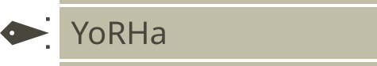

<div>
    
</div>
Placeholder for screenshot and YouTube link

# 👾 YoRHa
Dotfiles inspired by `NieR: Automata` UI


## 📥 Installation
### Required Arch Packages
> ```sh
> paru -S hyprland hyprlauncher hyprlock hypridle hyprpolkitagent hyprshade hyprshutdown foot grim fish theme.sh starship ttf-ibmplex-mono-nerd gnome-bluetooth wl-clipboard libdbusmenu-gtk3 brightnessctl gnome-bluetooth-3.0 xorg-xrandr unimatrix aylurs-gtk-shell libastal-meta dart-sass typescript yazi cpio cmake git meson gcc stow
> ```

### Install Legacy AGSv1 (v1.9.0 with patches)
Note: Migration from AGSv1 to v3 is in progress. Upon completion of this migration, this dependency on the AGSv1 is to be removed.

1. Get `aylurs-gtk-shell` package build
    > `paru -G aylurs-gtk-shell`

2. Copy package build files for `agsv1`
    > ```sh
    > git clone https://github.com/kotontrion/PKGBUILDS.git`
    > cp -a PKGBUILDS/agsv1/. aylurs-gtk-shell/
    > ```

3. Install missing dependencies and `agsv1` package
    > `makepkg -si`

### Required Fonts
Install the fonts below per the [Arch wiki](https://wiki.archlinux.org/title/Fonts#Manual_installation)
|Font|File|
|---|---|
|FOT-Rodin Pro|FOT-Rodin Pro M.ttf, FOT-Rodin Pro L.ttf|
|Fortune City|[FortuneCity.ttf](https://www.1001freefonts.com/fortune-city.font)|
|Angelic|  [Angelic-Regular.otf](https://github.com/NMeliksah/NierAngelicTMP/blob/main/Assets/Nier-Angelic/Angelic-Regular.otf)|


### Required `config.fish` Dependency
- [Solution to your Terminal Transition Tribulation (STTT)](https://github.com/flick0/sttt)

### Optional NieR: Automata Themes
- [Hyprcursor](https://github.com/striped-bass/NieR-Cursors)
- SDDM
- [Grub](https://github.com/striped-bass/yorha-grub-theme)
- [Trilium](https://github.com/Nriver/NieR-Automata-Trilium-Theme)
- [Obsidian](https://github.com/exloseur3d/nier-theme)
- [VS Code](https://github.com/Darius-Stone/vscode-nier-automata-tweaked)
- [Firefox menu](https://addons.mozilla.org/en-US/firefox/addon/nierautomata-menu-theme/)
- [Discord](https://github.com/accrazed/YoRHA-UI-BetterDiscord)
### Install and enable `hyprbars` plugin via `hyprpm`
> ```sh
> hyprpm update
> hyprpm add https://github.com/hyprwm/hyprland-plugins
> hyprpm enable hyprbars
> ```
### Clone dotfiles and link with `Stow`
> ```sh
> git clone -b hyprland-yorha-test https://github.com/striped-bass/dotfiles.git
> cd ~/dotfiles
> stow .
> ```

## ✨ Features
|Feature|Progress|Notes|
|---|---|---|
|Fish theme|Complete|Uses STTT transitions|
|Starship theme|Complete||
|Foot theme|Complete|Based on gruvbox|
|Hyprbars theme|Complete|[Buttons aren't responsive](https://github.com/hyprwm/hyprland-plugins/issues/635)|
|Hyprlock theme|Complete|Based on the [main display in the Bunker's command room](https://lparchive.org/NieR-Automata/Update%2007/23-debunked_(32).jpg), key bind: Super + L|
|Animated wallpaper|Partial|Need to animate the 6 diagonal lines|
|Screen shader|Complete|Grid effect and limb darkening, toggle using System Menu|
|Unimatrix that uses Angelic|Complete||
|Border widget|Partial|Switch from `dots-3-symbolic.svg` to `dots-2-symbolic.svg` based on horizontal cursor position|
|Slurp clone made in AGS|Partial|Need to migrate `geom` transition to AGSv3, avoid blurring the screenshot's border|
|Light/dark mode|Partial|Wait for v0.5.5 of hyprtoolkit to implement light/dark theme for hyprtoolkit, need to migrate `banner` transition from AGSv1 to AGSv3, toggle using System Menu|
|Bar|Partial|Bar button functionality and styling are incomplete|
|Notifications|Not started|Based on [in-game dialog/subtitle overlays that use the Clearwater font](https://www.reddit.com/r/nier/comments/6fz2jk/the_subtitle_font_what_is_it/)|
|Music widget|Not started||
|Sound effects|Not started|Add in-game sound effects|

## Thanks to
- [Archived blog post](https://web.archive.org/web/20260130001110/https://www.platinumgames.com/official-blog/article/9624) by the PlatinumGames on UI design of NieR: Automata
- [NieR: Automata settings menu](https://codepen.io/RobotsPlay/pen/bGeNGdx) on CodePen
- [SVG](https://github.com/gigsoll/YoRHaLogo) for YoRHA logo
- [Let's Play archive](https://lparchive.org/NieR-Automata/) for NieR: Automata

## Unused references
- [NieR: Automata logo SVG](https://worldvectorlogo.com/logo/nier-automata-1) that uses ITC Benguiat font
- [NieR: Automata Ver1.1a logo SVG](https://upload.wikimedia.org/wikipedia/commons/d/d4/NieR_Automata_Ver1.1a_logo.svg) that uses Termina font